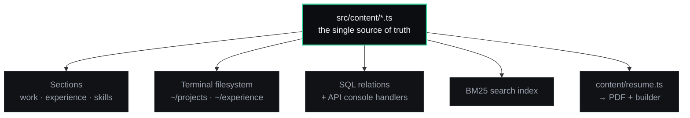

<p align="center">
  
</p>

<p align="center">
  <a href="https://sahiltalaviya-portfolio.netlify.app"><b>sahiltalaviya-portfolio.netlify.app</b></a>
  &nbsp;·&nbsp;
  <a href="https://sahiltalaviya-portfolio.netlify.app/lab">/lab</a>
  &nbsp;·&nbsp;
  <a href="https://sahiltalaviya-portfolio.netlify.app/motion">/motion</a>
</p>

<p align="center">
  
  
  
  
  
  
</p>

---

## What this is

A portfolio that argues by demonstration rather than by adjective.

Most developer portfolios describe what someone can build. This one hands you the thing and lets you run it: a working shell in the hero, a SQL engine you can query, three pathfinding algorithms racing on a maze you drew, an assembler with its own virtual machine. Every engine behind those is a pure, dependency-free module, and every one of them is tested.

The claim it exists to support: **complete systems, end to end** — schema, API, interface, deployment, and the automation that runs them.

## The three routes

| Route | What lives there |
|---|---|
| **`/`** | The portfolio. Hero with a live terminal, work, experience, skills, contact. |
| **`/lab`** | **18 runnable exhibits** — algorithms, automation tooling, games, and three things built purely out of curiosity. |
| **`/motion`** | **25 interface demos** in four groups, each paired with the mechanism that drives it and a note on *why* it is built that way. |

There is also a private résumé builder that renders the PDF this repo ships. It is linked once, at the bottom of the footer.

## `/lab` — systems you can run

<table>
<tr><td width="33%" valign="top">

**Algorithms**
- Pathfinding arena — BFS vs Dijkstra vs A\*, all three on every run
- Scheduling conflicts — half-open intervals, live clash detection
- BM25 search — per-term IDF exposed

</td><td width="33%" valign="top">

**Automation & data**
- Workflow playground
- API console
- SQL console — a real parser
- CSV → PostgreSQL DDL
- Automation ROI
- ERP schema explorer

</td><td width="33%" valign="top">

**For fun & curiosities**
- Minesweeper, 2048, Sudoku
- Sliding puzzle, Mastermind
- Tic-tac-toe vs solved minimax
- Assembly lab — assembler + VM
- Regex golf, Game of Life

</td></tr>
</table>

The interesting parts are the ones you would only notice by breaking them:

- **A\* reaches the same route as Dijkstra while expanding ~95% fewer cells** — and BFS returns a route that is shorter in steps but far more expensive on weighted terrain, because it answers a different question rather than answering the same one badly.
- **Minesweeper places its mines *after* the first click**, excluding it and its neighbours, so the opening always opens a region instead of ending on a coin flip.
- **Sudoku boards are generated with a guaranteed unique solution** — each clue is removed only if exactly one solution survives.
- **The 15-puzzle checks parity before shuffling.** Exactly half of all permutations are unreachable; shuffling naively hands the player an impossible board one game in two, with no feedback.
- **The regex-golf exhibit runs a stranger's regex**, so it screens for catastrophic backtracking first — and the discriminator is subtle: `(a+)+` is dangerous, `(-[a-z]+)+` is not, because each repetition must consume a literal `-`.

## `/motion` — the interface those systems wear

Twenty-five demos: buttons, components, advanced motion-value work, and six animated backgrounds — five on canvas, one built purely from transforms.

**The premise is the opposite of an animation library.** Each is framer-motion, canvas or plain CSS in roughly fifteen lines. Installing a component kit to service this page would cost more than writing them, and the claim collapses if the kit needs a package — so there is no animation dependency here, and there will not be one.

The exhibit is the *note*, not the animation: ripple diameter measured to the furthest corner, odometer keyed per slot and zero-padded, skeleton bar heights equal to the line-heights they stand in for, dismissal on velocity *or* distance in the swipe deck.

## Architecture



**Content never lives in a component.** Add a project to `src/content/projects.ts` and it appears in the Work section, under `~/projects` in both terminals, as a row in the SQL console, in the search index, and in the résumé — automatically. A terminal whose contents drift from the rest of the site is worse than no terminal.

Three more load-bearing decisions:

- **Lenis owns scrolling**, driven off framer-motion's frame loop rather than its own `requestAnimationFrame`. Two tickers fighting over one frame shows up as jitter on every scroll-linked animation.
- **The chrome is a layout route.** Navbar, footer, cursor and command palette mount once and survive navigation — when each page rendered its own copy, a client-side navigation looked exactly like a full page reload.
- **Failure is contained.** A failed dynamic import self-heals once (a tab left open across a deploy still holds the old module graph), and two error boundaries mean a throw on one route cannot poison the others.

## Tested where it counts

There is no test framework here. The engines behind the lab are pure and free of DOM access precisely so they can be bundled with esbuild and asserted against in plain Node:

```sh
npx esbuild src/lib/pathfinding.ts --bundle --format=esm --alias:@=./src
```

**471 assertions across 16 engines**, and they have caught real bugs that neither lint nor the compiler can see: a `>=` comparing lexically instead of numerically, a stemmer eating `node.js`, spurious `UNIQUE` constraints inferred from five distinct rows, an infinite Sudoku solve on a contradictory board, and a ReDoS screen that refused its own reference solution.

## Running it

```sh
npm i          # npm is the package manager
npm run dev    # http://localhost:8080
npm run build  # production build to dist/
npm run lint   # 0 errors
```

Node 18+. No environment variables, no backend, no API keys — the site is fully static and renders offline: fonts are self-hosted, and there is not a single CDN icon or remote image anywhere in it.

```sh
node resume/build.mjs   # regenerate public/Sahil Talaviya Resume.pdf
```

## Layout

```
src/
├── content/      all copy and data — edit here, never in a component
├── components/
│   ├── lab/          the 18 exhibits
│   ├── motion-lab/   the 25 demos
│   ├── resume/       résumé templates (shared by the page and the PDF build)
│   ├── hero/  fx/  motion/  ui-kit/
│   └── ui/           shadcn/ui
├── lib/          pure engines — SQL, BM25, pathfinding, noise, games…
├── hooks/
└── pages/        Index · Lab · Motion · ResumeBuilder · NotFound
```

See [ARCHITECTURE.md](ARCHITECTURE.md) for the decisions behind all of this — including the ones that were wrong the first time.

---

<p align="center">
  <sub><b>Created by Sahil Talaviya</b></sub><br />
  <sub>
    <a href="https://sahiltalaviya-portfolio.netlify.app">Portfolio</a> ·
    <a href="https://github.com/sahiltalaviya99">GitHub</a> ·
    <a href="https://linkedin.com/in/sahil-talaviya-99o9657o18">LinkedIn</a> ·
    <a href="mailto:sahiltalaviya9922@gmail.com">sahiltalaviya9922@gmail.com</a>
  </sub>
</p>
